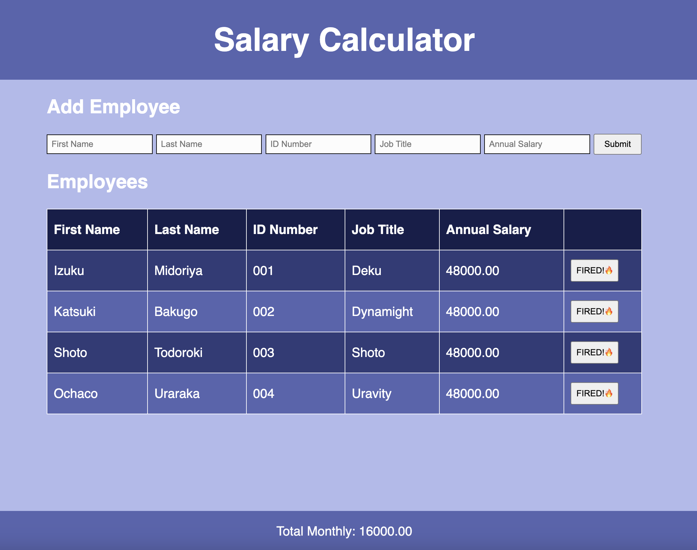
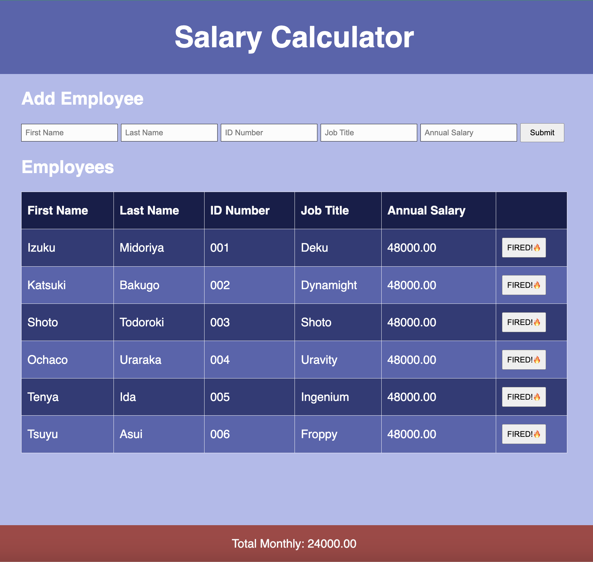

# Project Name
Weekend Salary Calculator

# Description:
Duration: 2 Days

For this project, I needed to combine HTML, Javascript, and CSS to create a functional employee information table and cost calculator. The user needed to be able to input an employee's first name, last name, ID number, job title, and annual salary and have this information appear on the employee table. The other part of this application is a monthly cost calculator. As an employee is added, the footer is updated with a total monthly cost based off of the employee's inputed annual salary. This montly cost calculator adds up the divided annual salaries. An employee is able to be removed, and their associated monthly cost will also be removed from the monthly calculater. This was done by creating functions in Javascript, incorporating them into the HTML, and tying in the CSS to the appropriate funtions.

## Screen Shots:

## Uses:
-Organize employee data.
-Calculate monthly costs of employees.
-Alert to monthly over budget costs.

## Built With
VS Code

## Acknowledgement
Thanks to Prime Digital Academy who equipped and helped me to make this application a reality.

